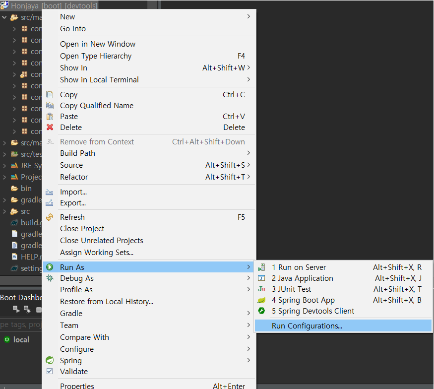
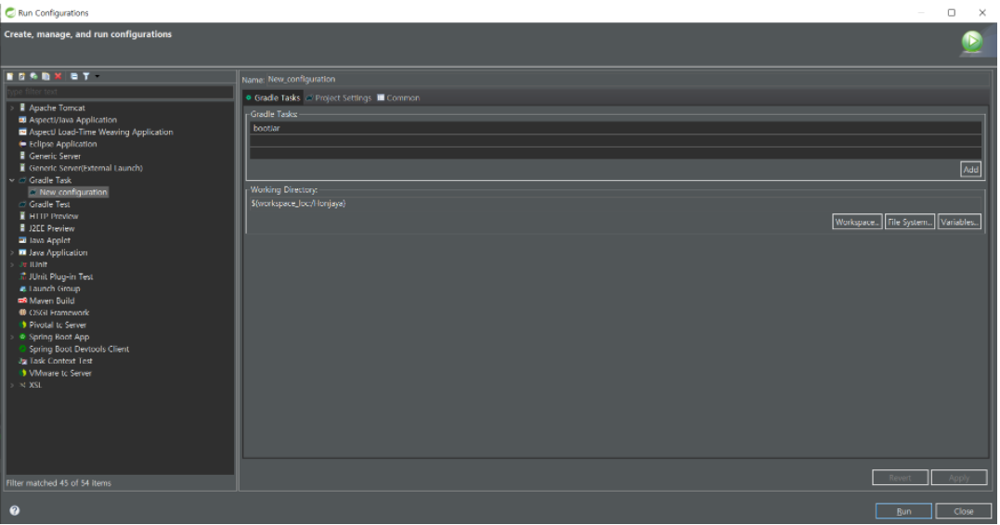

# 백엔드 배포

## 1. STS 툴에서 Run AS >  Run Configurations...



## 2. Gradle Task > New_configuration 을 클릭한 후 Gradle Tasks에 bootJar를 Add하고 Run을 누르면 build 됨

\

- workspace 폴더/프로젝트 폴더/build/libs 폴더로 이동하면 Jar파일이 생성되어 있다.


### 3. Jar 파일을 EC2 서버의 실행시킬 위치로 드래그하여 이동 후 명령어 실행

```bash
java -jar Honjaya*.jar
```

```bash
nohup java -jar Honjaya*.jar
```

> 백그라운드에서 실행할 수 있는 명령어.
>
> 아래의 명령어를 실행한 후 EC2 GUI 창을 닫아도 Jar는 실행되고 있다.

```bash
ps -ef | grep Honjaya
```

> 백그라운드로 실행되고 있는 프로그램을 종료하고 싶을 시, 먼저 아래의 명령어를 쳐서 해당 이름으로 실행되고 있는 프로그램의 pid 번호를 알아낸다. 가장 왼쪽에 이름이 있고, 그 오른쪽에 뜨는 번호가 pid 번호다.

```bash
kill -9 000000
```

> 해당 pid 번호를 통해 프로그램을 종료시킨다. (kill -9 {pid})


---

- 배포 시 특이사항: MySQL 계정 / 암호 + SMTP 구글 이메일 전송용 계정 / 암호는 명시하지 않았습니다. 필요할 시에 팀원에게 연락을 해주시고, 연락이 어려울 시, DB 덤프 파일을 함께 제출하므로 직접 생성 후 사용하셔도 됩니다.